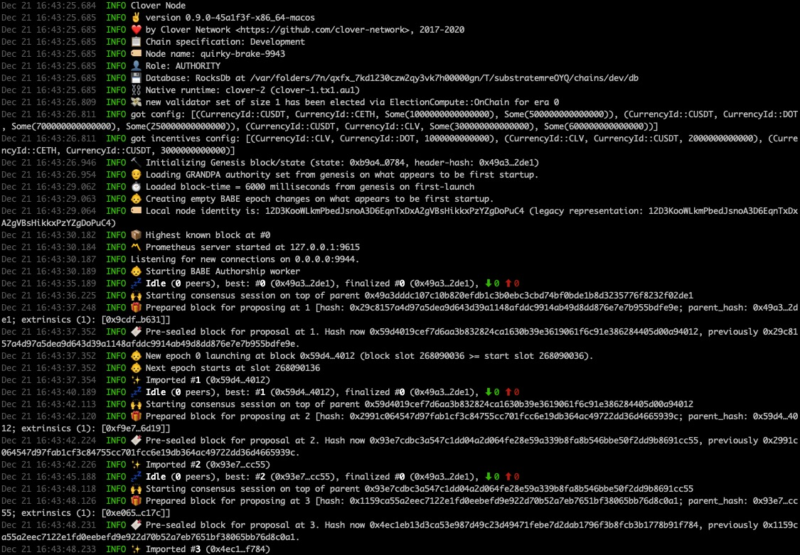
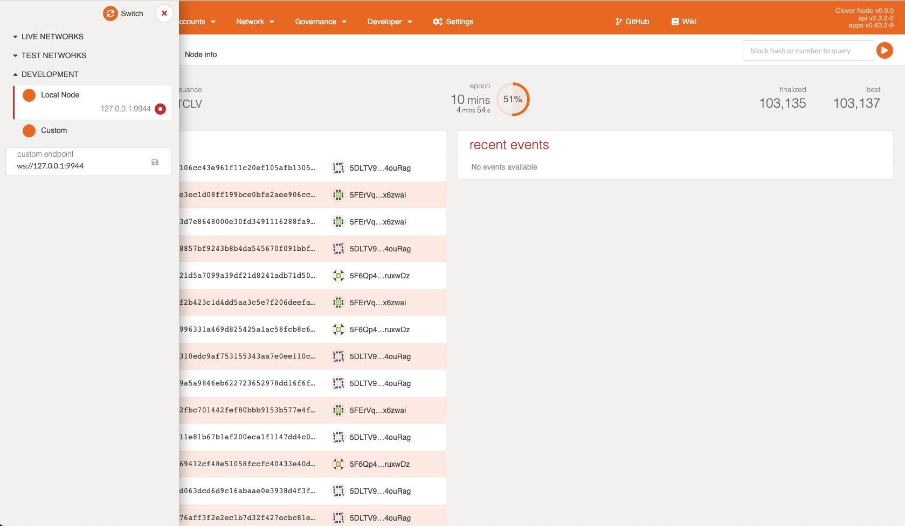

# Setting Up a Node

### Compile the node <a id="installation-and-setup"></a>

We start by cloning the master branch of the Clover repo that you can find here: [https://github.com/clover-network/clover](https://github.com/clover-network/clover)

```bash
git clone git@github.com:clover-network/clover.git
cd clover
```

Once you have followed all of the procedures above, it's time to build the standalone node by running:

```bash
cargo build --release
```


The initial build will take a while. Depending on your hardware, you should plan on 30 minutes for the build process to finish.


### Run the Node

Then you will want to run the node in dev mode using the following command:

```text
./target/release/clover --dev --rpc-cors=all  --unsafe-rpc-external  --unsafe-ws-external --validator --tmp -lruntime=debug
```

You should see an output that looks like the following, showing that blocks are being produced:




The local standalone Clover node provides two RPC endpoints:

* HTTP: `http://127.0.0.1:9933`
* WS: `ws://127.0.0.1:9944`


### Connecting Polkadot JS Apps to a Local Clover Node <a id="connecting-polkadot-js-apps-to-a-local-moonbeam-node"></a>

The locally-running Clover node is a Substrate-based node, so we can interact with it using standard Substrate tools. Let’s start by connecting to it with Clover JS Apps.  
Open a browser to: [https://apps.clover.finance/\#/explorer](https://apps.clover.finance/#/explorer). This will open Polkadot JS Apps which automatically connects to Polkadot MainNet.


Click on the top left corner to open the menu to configure the networks, and then navigate down to open the Development sub-menu. In there, you will want to toggle the "Local Node" option which points Polkadot JS Apps to `ws://127.0.0.1:9944`. Next, hit on the Switch button and the site should connect to your standalone Clover node.



With Polkadot JS Apps connected, you will see the standalone Clover node producing blocks.


