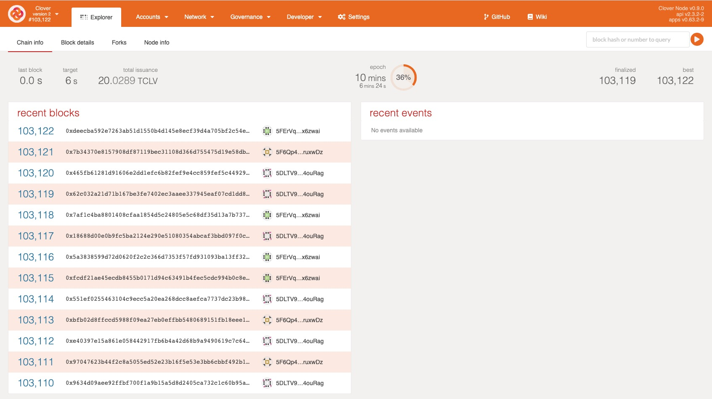
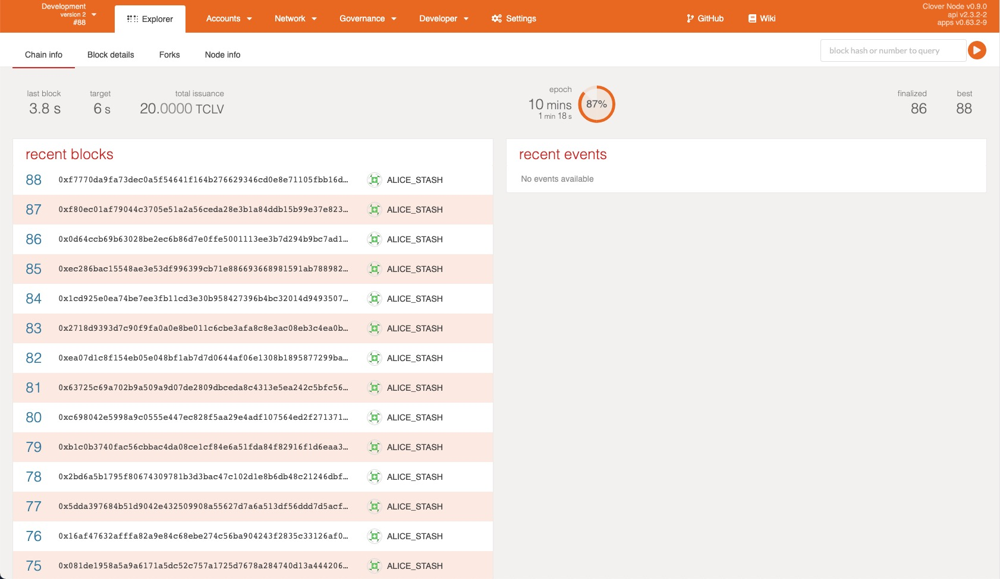

# Local CLV Network

## 1. Install build tools & libraries <a id="__docusaurus"></a>

Clover setup is easiest on Unix-based operating systems like macOS or Linux. Here are the instructions to install Rust's toolchains. If you have already done this before, please go to the Step 3

#### macOS

Open the Terminal application and execute the following commands:

```bash
# Install Homebrew if necessary https://brew.sh/
/bin/bash -c "$(curl -fsSL https://raw.githubusercontent.com/Homebrew/install/master/install.sh)"

# Make sure Homebrew is up-to-date, install openssl and cmake
brew update
brew install openssl cmake
```

#### Ubuntu/Debian

Use a terminal shell to execute the following commands:

```bash
sudo apt update
# May prompt for location information
sudo apt install -y cmake pkg-config libssl-dev git build-essential clang libclang-dev curl
```

#### Arch Linux

Run these commands from a terminal:

```bash
pacman -Syu --needed --noconfirm cmake gcc openssl-1.0 pkgconf git clang
export OPENSSL_LIB_DIR="/usr/lib/openssl-1.0"
export OPENSSL_INCLUDE_DIR="/usr/include/openssl-1.0"
```

## 2. Install Rust toolchain

This guide uses [`rustup`](https://rustup.rs/) to help manage the Rust toolchain. First install and configure `rustup`:

```bash
# Install
curl https://sh.rustup.rs -sSf | sh
# Configure
source ~/.cargo/env
```

## 3. Compile the node

We start by cloning the master branch of the Clover repo that you can find here: [https://github.com/clover-network/clover](https://github.com/clover-network/clover)

```bash
git clone git@github.com:clover-network/clover.git
cd clover
```

Once you have followed all of the procedures above, it's time to build the standalone node by running:

```bash
./scripts/init.sh
cargo build --release
```


The initial build will take a while. Depending on your hardware, you should plan on 30 minutes for the build process to finish.


## 4. Run the Node

Then you will want to run the node in dev mode using the following command:

```text
./target/release/clover --dev --rpc-cors=all  --unsafe-rpc-external  --unsafe-ws-external --validator --tmp -lruntime=debug
```

You should see an output that looks like the following, showing that blocks are being produced:



The local standalone Clover node provides two RPC endpoints:

* HTTP: `http://127.0.0.1:9933`
* WS: `ws://127.0.0.1:9944`


### Connecting Polkadot JS Apps to a Local Clover Node <a id="connecting-polkadot-js-apps-to-a-local-moonbeam-node"></a>

The locally-running Clover node is a Substrate-based node, so we can interact with it using standard Substrate tools. Let’s start by connecting to it with Clover JS Apps.  
Open a browser to: [https://apps.clover.finance/\#/explorer](https://apps.clover.finance/#/explorer). This will open Polkadot JS Apps which automatically connects to Polkadot MainNet.



Click on the top left corner to open the menu to configure the networks, and then navigate down to open the Development sub-menu. In there, you will want to toggle the "Local Node" option which points Polkadot JS Apps to `ws://127.0.0.1:9944`. Next, hit on the Switch button and the site should connect to your standalone Clover node.


With Polkadot JS Apps connected, you will see the standalone Clover node producing blocks.



